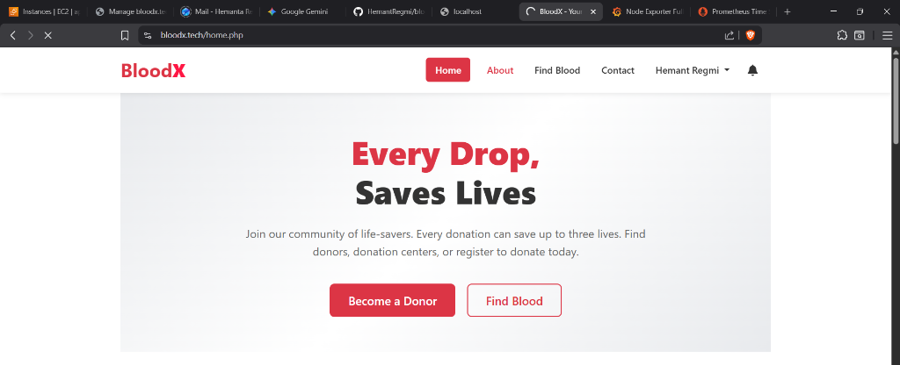
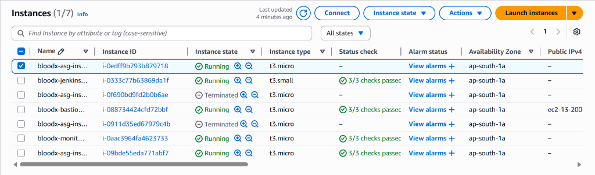
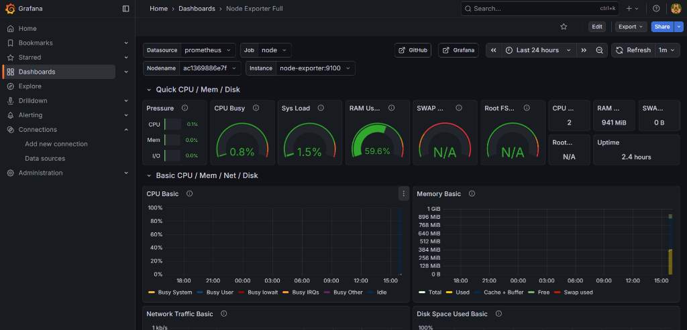

# BloodX - Cloud-Native Blood Donation System

BloodX is a modern, scalable Blood Donation Management System deployed on **AWS** using **Terraform** (Infrastructure as Code) and **Jenkins** (CI/CD). It connects donors with patients in need, featuring a robust admin dashboard and real-time monitoring.

---

## 🏗️ Architecture
This project demonstrates a complete real-world **DevOps** lifecycle:
- **Cloud Provider:** AWS (VPC, Public/Private Subnets, IGW, NAT Gateway).
- **Compute:** Auto Scaling Group (EC2 t3.micro) behind an Application Load Balancer.
- **Database:** Amazon RDS (MySQL 8) in a private subnet.
- **CI/CD:** Jenkins Pipeline with Docker & Amazon ECR.
- **Monitoring:** Prometheus & Grafana for real-time system metrics.
- **Security:** Strict Security Groups, Bastion Host for SSH access.

---

## 📸 Project Screenshots

### 1. Live Application
A responsive, user-friendly interface for donors and seekers.

### 2. AWS Infrastructure
Fully automated infrastructure provisioning using Terraform.

### 3. Database

### 4. AWS ECR

### 5. CI/CD Pipeline
Automated build, test, and deploy via Jenkins.

### 6. System Monitoring
Real-time observability of CPU, RAM, and Network trafffic using Grafana.

## 🛡️ Service Reliability & Persistence

To ensure high availability for mission-critical DevOps tools, we implement strict persistence strategies:

### 1. Jenkins Server (Systemd)
- **Mechanism:** Managed via `systemd` (Linux Service Manager).
- **Configuration:** Service is explicitly enabled (`sudo systemctl enable jenkins`) during provisioning.
- **Behavior:** Automatically starts on boot and restarts in case of process crashes.

### 2. Monitoring Stack (Docker Restart Policies)
- **Mechanism:** Docker Compose `restart` policies.
- **Configuration:** Prometheus and Grafana containers are configured with `restart: always`.
- **Behavior:** The Docker daemon ensures these containers are always running, even after a host reboot or daemon crash.

